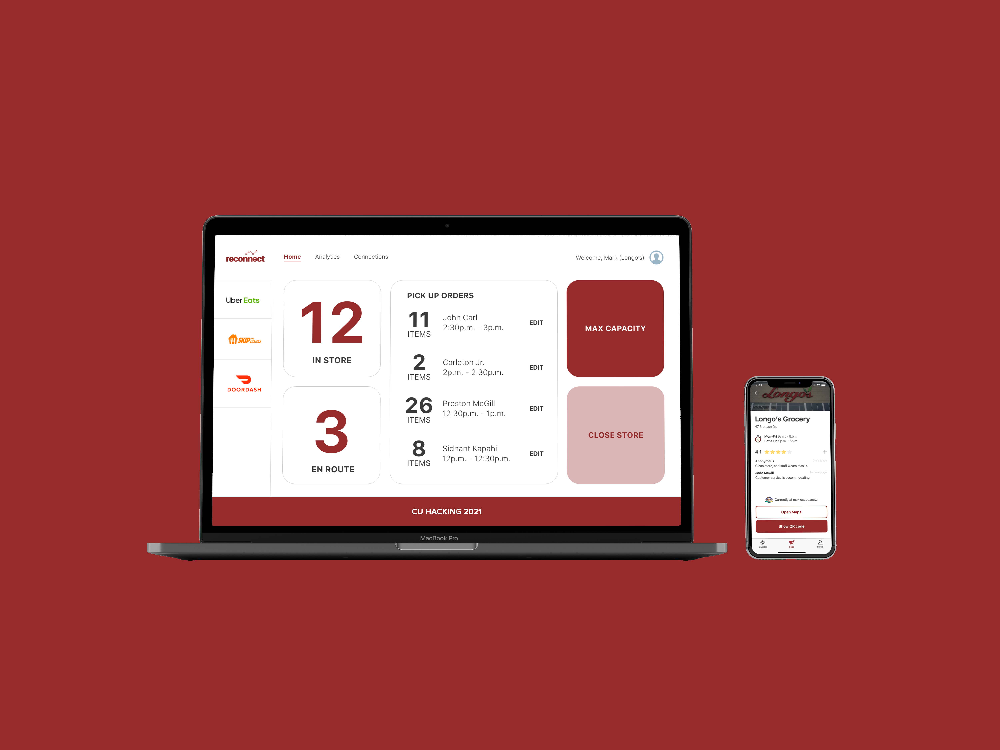
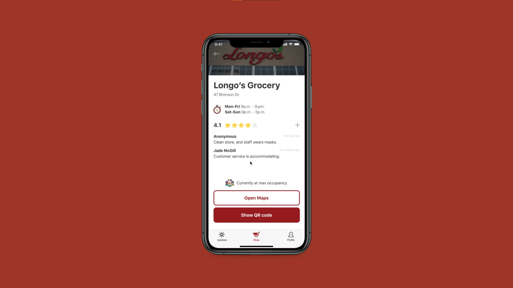
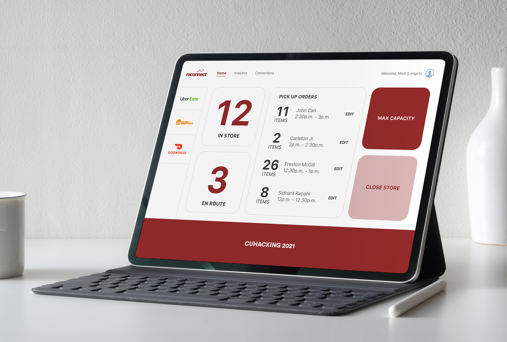

# Reconnect

## Table of Contents
- [Getting Started](#getting-started)
- [Description](#description)

## Getting Started

* [Download the installer](https://nodejs.org/) for NodeJS.
* Install the Ionic CLI globally: `npm install -g ionic`
* Clone the repository: `git clone https://github.com/SeniorFluffie/Reconnect.git`.
* Navigate to the project directory `cd ./Reconnect`
* Run `npm install` from the project root to install all required dependencies.
* Run `ionic serve` in a terminal from the project's root folder.

## Description
Reconnect is the perfect platform for connecting store owners to customers in a post-covid world. Ensuring stores are comfortable with thier customers, and still helping those they aren't. We imagine this as a government first app, with information being shared about updates on the pandemic. There are multiple components, here is what's included:

### Client-facing app
This is where consumers interact with our platform. They sign up and then input their vaccination code, which means we can verify if they have gotten their vaccination and stores that are only allowing people inside who are vaccined can go in. This is a great place to find stores, information, and also view your history of interactions with the stores.

### Store View
We know that stores already have tablets for deleivery apps. So we thought we would design an encompassing dashboard for reconnect. Where you can view the occupancy in your store, and also orders coming in for pick-up. This is great on the store side as it also allows them to scan people in/ out of the system.

